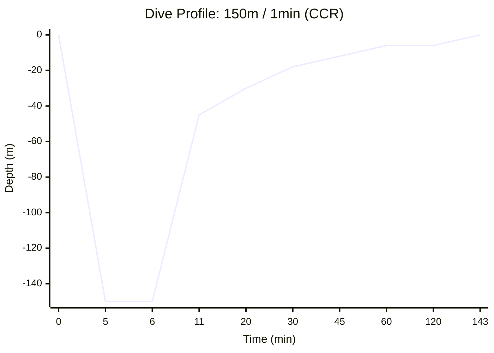

# Dive Plan Report: 150m for 1 minute

**Location:** Technical Deep Dive  
**Date:** 2026-03-14  
**Gas:** Tx 6/90 (6% O2, 90% He)  
**Model:** Bühlmann ZHL-16B with Gradient Factors (50/80)

---

## 1. Dive Profile Visualization

---

## 2. CCR Plan (Setpoint 1.2)

**Diluent:** Tx 6/90  
**Bottom Setpoint:** 1.2 bar  
**Deco Setpoint:** 1.2 bar  
**Descent Rate:** 20 m/min | **Ascent Rate:** 10 m/min (1m/min < 10m)

### Deco Schedule (Condensed)
| Depth | Run Time | Stop Time | Gas | CNS % | OTU |
| :--- | :--- | :--- | :--- | :--- | :--- |
| **150m** | **8.5 min** | **1 min** | **Tx 6/90** | - | - |
| 112m | **Ascent** | **-** | (Off-gassing starts) | - | - |
| 45m | 20 min | 1 min | CCR SP 1.2 | 9.7% | 26.8 |
| 42m | 21 min | 1 min | CCR SP 1.2 | 10.3% | 28.6 |
| 39m | 23 min | 1 min | CCR SP 1.2 | 11.0% | 30.5 |
| 36m | 24 min | 1 min | CCR SP 1.2 | 11.7% | 32.4 |
| 33m | 27 min | 2 min | CCR SP 1.2 | 12.9% | 35.8 |
| 30m | 29 min | 2 min | CCR SP 1.2 | 14.2% | 39.4 |
| 27m | 32 min | 2 min | CCR SP 1.2 | 15.5% | 43.0 |
| 24m | 36 min | 3 min | CCR SP 1.2 | 17.3% | 47.9 |
| 21m | 40 min | 4 min | CCR SP 1.2 | 19.7% | 54.5 |
| 18m | 46 min | 5 min | CCR SP 1.2 | 22.7% | 62.7 |
| 15m | 55 min | 7 min | CCR SP 1.2 | 26.9% | 74.4 |
| 12m | 64 min | 7 min | CCR SP 1.2 | 31.5% | 86.8 |
| 9m | 75 min | 5 min | CCR SP 1.2 | 37.3% | 102.9 |
| 6m | 137 min | 59 min | CCR SP 1.2 | 69.6% | 190.6 |
| 0m | 143 min | **Surface** | Air | **69.6%** | **190.6** |

---

## 3. Gas Requirements & OC Bailout Analysis
### CCR Gas Usage (Normal Operation)
- **CCR Oxygen:** 143 L | **48 bar** (on 3L cylinder)
- **Normal Diluent Consumption:** ~100 L | **6 bar** (on 16.5L cylinder)

### OC Bailout Plan (Emergency Only)
If the CCR fails at the bottom, the following gases are required for an Open Circuit ascent:
- **Tx 6/90 (Diluent):** 3,437 L | **208 bar** (!!! EXCEEDS 200 BAR !!!)
- **Tx 50/15 (Stage):** 1,778 L | **329 bar** (!!! EXCEEDS 200 BAR !!! - **Requires 2x 5.4L stages**)
- **Oxygen (Stage):** 1,824 L | **338 bar** (!!! EXCEEDS 200 BAR !!! - **Requires 2x 5.4L stages**)

#### OC Bailout Schedule (GF 50/80)
| Depth | Run Time | Stop Time | Gas |
| :--- | :--- | :--- | :--- |
| **150m** | **6 min** | **1 min** | **Tx 6/90** |
| 112m | **Ascent** | **-** | (Off-gassing starts) |
| 51m | 19 min | 1 min | Tx 6/90 |
| 48m | 22 min | 2 min | Tx 6/90 |
| 45m | 24 min | 1 min | Tx 6/90 |
| 42m | 25 min | 1 min | Tx 6/90 |
| 39m | 28 min | 2 min | Tx 6/90 |
| 36m | 31 min | 3 min | Tx 6/90 |
| 33m | 36 min | 4 min | Tx 6/90 |
| 30m | 42 min | 5 min | Tx 6/90 |
| 27m | 52 min | 8 min | Tx 6/90 |
| 24m | 62 min | 9 min | Tx 6/90 |
| 21m | 70 min | 6 min | Tx 50/15 |
| 18m | 76 min | 5 min | Tx 50/15 |
| 15m | 87 min | 10 min | Tx 50/15 |
| 12m | 104 min | 13 min | Tx 50/15 |
| 9m | 146 min | 17 min | Tx 50/15 |
| 6m | 225 min | 76 min | Oxygen |
| 0m | 231 min | **Surface** | Air |

---

## 4. Safety Warnings
- **Ascent Rate:** Slowed to 1m/min for the final 10m to surface.
- **CNS Clock:** 69.6% (Within 80% safety margin).
- **OTU Exposure:** 190.6 (Safe for single dive).
- **Run Time:** Total run time is ~143 minutes (CCR).
- **6m Floor:** Plan uses a mandatory 6m decompression floor.

## 5. End-of-Dive Tissue Saturation (CCR Heat Map)
Final inert gas tensions across the 16 Bühlmann compartments relative to their surface M-Values ($M_0$).

| Comp | Half-time (N2/He) | $P_{N2}$ (bar) | $P_{He}$ (bar) | Tension | $M_0$ Limit | Load % | Heat Map |
| :---: | :---: | :---: | :---: | :---: | :---: | :---: | :--- |
| 1 | 4.0/1.5 | 0.01 | 0.05 | 0.06 | 4.03 | 1.4% | `░░░░░░░░░░` |
| 2 | 8.0/3.0 | 0.01 | 0.11 | 0.12 | 3.10 | 3.8% | `░░░░░░░░░░` |
| 3 | 12.5/4.7 | 0.01 | 0.16 | 0.17 | 2.71 | 6.2% | `░░░░░░░░░░` |
| 4 | 18.5/7.0 | 0.02 | 0.20 | 0.22 | 2.41 | 8.9% | `░░░░░░░░░░` |
| 5 | 27.0/10.2 | 0.04 | 0.24 | 0.28 | 2.20 | 12.6% | `█░░░░░░░░░` |
| 6 | 38.3/14.5 | 0.09 | 0.29 | 0.38 | 2.03 | 18.7% | `█░░░░░░░░░` |
| 7 | 54.3/20.5 | 0.16 | 0.40 | 0.56 | 1.87 | 29.9% | `██░░░░░░░░` |
| 8 | 77.0/29.1 | 0.25 | 0.57 | 0.82 | 1.76 | 46.5% | `████░░░░░░` |
| 9 | 109.0/41.2 | 0.34 | 0.75 | 1.09 | 1.68 | 64.9% | `██████░░░░` |
| 10 | 146.0/55.2 | 0.41 | 0.85 | 1.27 | 1.62 | 78.1% | `███████░░░` |
| 11 | 187.0/70.7 | 0.47 | 0.89 | 1.36 | 1.58 | 85.8% | `████████░░` ⚠️ |
| 12 | 239.0/90.3 | 0.52 | 0.87 | 1.39 | 1.55 | 89.9% | `████████░░` ⚠️ |
| 13 | 305.0/115.3 | 0.56 | 0.82 | 1.38 | 1.53 | 90.8% | `█████████░` ⚠️ |
| 14 | 390.0/147.4 | 0.60 | 0.74 | 1.34 | 1.50 | 89.7% | `████████░░` ⚠️ |
| 15 | 498.0/188.2 | 0.63 | 0.65 | 1.28 | 1.47 | 87.4% | `████████░░` ⚠️ |
| 16 | 635.0/240.0 | 0.65 | 0.56 | 1.21 | 1.44 | 84.4% | `████████░░` |
