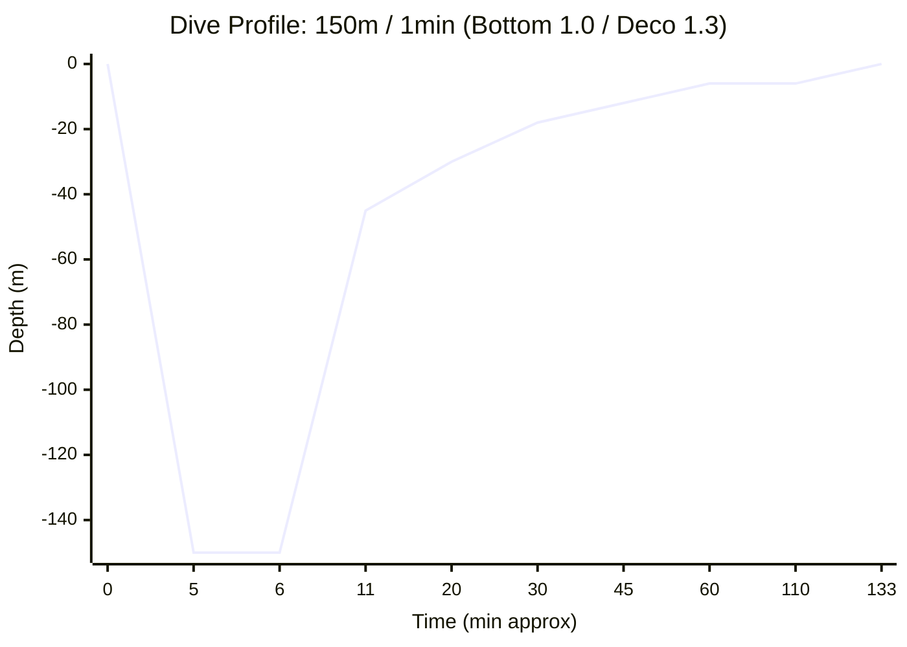

# Dive Plan Report: 150m for 1 minute (Bottom Low / Deco High)

**Location:** Technical Deep Dive - Advanced Setpoint Logic  
**Date:** 2026-03-14  
**Gas:** Tx 6/90 (6% O2, 90% He)  
**Model:** Bühlmann ZHL-16B with Gradient Factors (50/80)

---

## 1. Dive Profile Visualization

---

## 2. Advanced CCR Plan

**Diluent:** Tx 6/90  
**Bottom Setpoint:** 1.0 bar  
**Deco Setpoint:** 1.3 bar  
**Descent Rate:** 20 m/min | **Ascent Rate:** 10 m/min (1m/min < 10m)

### Deco Schedule (Condensed)
| Depth | Run Time | Stop Time | Gas | CNS % | OTU |
| :--- | :--- | :--- | :--- | :--- | :--- |
| **150m** | **8.5 min** | **1 min** | **Tx 6/90 (SP 1.0)** | - | - |
| 115m | **Ascent** | **-** | (Off-gassing starts) | - | - |
| 45m | 20 min | 1 min | CCR SP 1.3 | 9.4% | 25.9 |
| 42m | 21 min | 1 min | CCR SP 1.3 | 10.2% | 28.0 |
| 39m | 23 min | 1 min | CCR SP 1.3 | 11.1% | 30.2 |
| 36m | 24 min | 1 min | CCR SP 1.3 | 11.9% | 32.5 |
| 33m | 27 min | 2 min | CCR SP 1.3 | 13.5% | 36.6 |
| 30m | 29 min | 1 min | CCR SP 1.3 | 14.4% | 38.9 |
| 27m | 31 min | 2 min | CCR SP 1.3 | 15.9% | 42.8 |
| 24m | 35 min | 3 min | CCR SP 1.3 | 18.0% | 48.3 |
| 21m | 40 min | 4 min | CCR SP 1.3 | 20.8% | 55.7 |
| 18m | 44 min | 4 min | CCR SP 1.3 | 23.6% | 63.0 |
| 15m | 53 min | 7 min | CCR SP 1.3 | 28.6% | 76.0 |
| 12m | 62 min | 7 min | CCR SP 1.3 | 34.1% | 90.1 |
| 9m | 73 min | 4 min | CCR SP 1.3 | 41.1% | 107.9 |
| 6m | 127 min | 51 min | CCR SP 1.3 | 74.7% | 193.0 |
| 0m | 133 min | **Surface** | Air | **74.7%** | **193.0** |

---

## 3. Gas Requirements & OC Bailout Analysis
### CCR Gas Usage (Normal Operation)
- **CCR Oxygen:** 133 L | **44 bar** (on 3L cylinder)
- **Normal Diluent Consumption:** ~100 L | **6 bar** (on 16.5L cylinder)

### OC Bailout Plan (Emergency Only)
If the CCR fails at the bottom, the following gases are required for an Open Circuit ascent:
- **Tx 6/90 (Diluent):** 3,437 L | **208 bar** (!!! EXCEEDS 200 BAR !!!)
- **Tx 50/15 (Stage):** 1,778 L | **329 bar** (!!! EXCEEDS 200 BAR !!! - **Requires 2x 5.4L stages**)
- **Oxygen (Stage):** 1,824 L | **338 bar** (!!! EXCEEDS 200 BAR !!! - **Requires 2x 5.4L stages**)

#### OC Bailout Schedule (GF 50/80)
| Depth | Run Time | Stop Time | Gas |
| :--- | :--- | :--- | :--- |
| **150m** | **6 min** | **1 min** | **Tx 6/90** |
| 115m | **Ascent** | **-** | (Off-gassing starts) |
| 51m | 19 min | 1 min | Tx 6/90 |
| 48m | 22 min | 2 min | Tx 6/90 |
| 45m | 24 min | 1 min | Tx 6/90 |
| 42m | 25 min | 1 min | Tx 6/90 |
| 39m | 28 min | 2 min | Tx 6/90 |
| 36m | 31 min | 3 min | Tx 6/90 |
| 33m | 36 min | 4 min | Tx 6/90 |
| 30m | 42 min | 5 min | Tx 6/90 |
| 27m | 52 min | 8 min | Tx 6/90 |
| 24m | 62 min | 9 min | Tx 6/90 |
| 21m | 70 min | 6 min | Tx 50/15 |
| 18m | 76 min | 5 min | Tx 50/15 |
| 15m | 87 min | 10 min | Tx 50/15 |
| 12m | 104 min | 13 min | Tx 50/15 |
| 9m | 146 min | 17 min | Tx 50/15 |
| 6m | 225 min | 76 min | Oxygen |
| 0m | 231 min | **Surface** | Air |

---

## 4. Safety Warnings & Analysis
- **Ascent Rate:** Slowed to 1m/min for the final 10m to surface.
- **CNS Exposure:** 74.7% (Within 80% safety limit).
- **OTU Exposure:** 193.0 (Safe for single dive).
- **Efficiency:** Total run time is ~133 minutes (CCR).
- **Logistics:** Significant gas savings compared to the 5min bottom time version.

## 5. End-of-Dive Tissue Saturation (CCR Heat Map)
Final inert gas tensions across the 16 Bühlmann compartments relative to their surface M-Values ($M_0$).

| Comp | Half-time (N2/He) | $P_{N2}$ (bar) | $P_{He}$ (bar) | Tension | $M_0$ Limit | Load % | Heat Map |
| :---: | :---: | :---: | :---: | :---: | :---: | :---: | :--- |
| 1 | 4.0/1.5 | 0.00 | -0.04 | -0.03 | 3.27 | -1.1% | `░░░░░░░░░░` |
| 2 | 8.0/3.0 | 0.01 | 0.01 | 0.02 | 2.99 | 0.7% | `░░░░░░░░░░` |
| 3 | 12.5/4.7 | 0.01 | 0.06 | 0.07 | 2.68 | 2.6% | `░░░░░░░░░░` |
| 4 | 18.5/7.0 | 0.02 | 0.10 | 0.12 | 2.39 | 5.0% | `░░░░░░░░░░` |
| 5 | 27.0/10.2 | 0.05 | 0.14 | 0.19 | 2.17 | 8.8% | `░░░░░░░░░░` |
| 6 | 38.3/14.5 | 0.10 | 0.21 | 0.31 | 2.01 | 15.6% | `█░░░░░░░░░` |
| 7 | 54.3/20.5 | 0.17 | 0.35 | 0.52 | 1.86 | 28.2% | `██░░░░░░░░` |
| 8 | 77.0/29.1 | 0.26 | 0.54 | 0.81 | 1.75 | 46.2% | `████░░░░░░` |
| 9 | 109.0/41.2 | 0.36 | 0.73 | 1.09 | 1.67 | 65.3% | `██████░░░░` |
| 10 | 146.0/55.2 | 0.43 | 0.84 | 1.27 | 1.62 | 78.4% | `███████░░░` |
| 11 | 187.0/70.7 | 0.49 | 0.87 | 1.35 | 1.58 | 85.7% | `████████░░` ⚠️ |
| 12 | 239.0/90.3 | 0.53 | 0.85 | 1.38 | 1.55 | 89.4% | `████████░░` ⚠️ |
| 13 | 305.0/115.3 | 0.57 | 0.79 | 1.37 | 1.52 | 90.0% | `████████░░` ⚠️ |
| 14 | 390.0/147.4 | 0.61 | 0.72 | 1.32 | 1.49 | 88.6% | `████████░░` ⚠️ |
| 15 | 498.0/188.2 | 0.64 | 0.63 | 1.26 | 1.46 | 86.2% | `████████░░` ⚠️ |
| 16 | 635.0/240.0 | 0.66 | 0.54 | 1.20 | 1.43 | 83.3% | `████████░░` |
