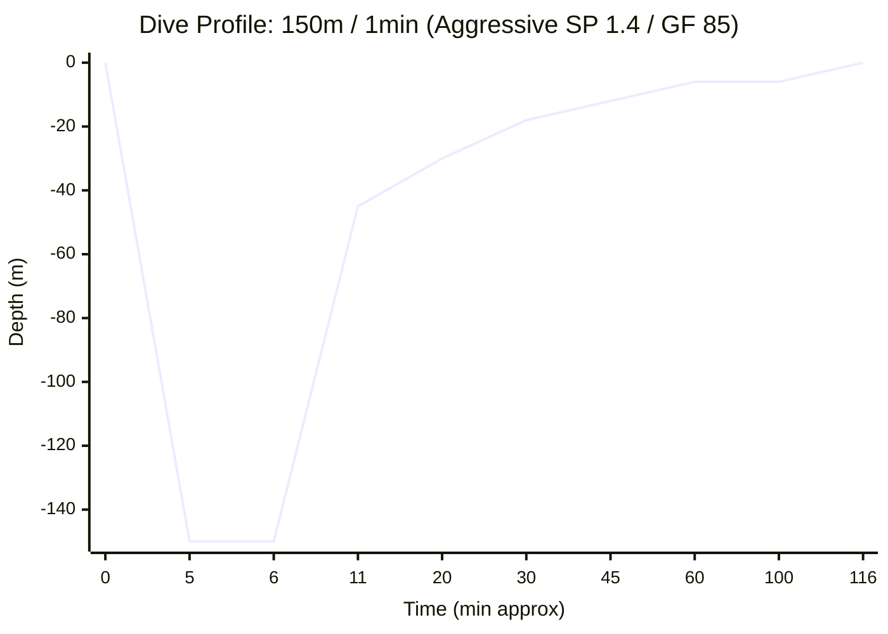

# Dive Plan Report: 150m for 1 minute (High-Aggression)

**Location:** Technical Deep Dive - Aggressive Decompression Logic  
**Date:** 2026-03-14  
**Gas:** Tx 6/90 (6% O2, 90% He)  
**Model:** Bühlmann ZHL-16B with Aggressive Gradient Factors (50/85)

---

## 1. Dive Profile Visualization

---

## 2. High-Aggression CCR Plan

**Diluent:** Tx 6/90  
**Bottom Setpoint:** 1.0 bar  
**Deco Setpoint:** 1.4 bar  
**Gradient Factors:** 50/85 (Aggressive High)  
**Descent Rate:** 20 m/min | **Ascent Rate:** 10 m/min (1m/min < 10m)

### Deco Schedule (Condensed)
| Depth | Run Time | Stop Time | Gas | CNS % | OTU |
| :--- | :--- | :--- | :--- | :--- | :--- |
| **150m** | **8.5 min** | **1 min** | **Tx 6/90 (SP 1.0)** | - | - |
| 116m | **Ascent** | **-** | (Off-gassing starts) | - | - |
| 45m | 20 min | 1 min | CCR SP 1.4 | 10.9% | 28.0 |
| 39m | 22 min | 1 min | CCR SP 1.4 | 12.1% | 30.8 |
| 36m | 23 min | 1 min | CCR SP 1.4 | 13.1% | 33.1 |
| 33m | 25 min | 1 min | CCR SP 1.4 | 14.0% | 35.5 |
| 30m | 27 min | 2 min | CCR SP 1.4 | 15.8% | 39.6 |
| 27m | 30 min | 2 min | CCR SP 1.4 | 17.7% | 44.1 |
| 24m | 32 min | 2 min | CCR SP 1.4 | 19.5% | 48.4 |
| 21m | 36 min | 3 min | CCR SP 1.4 | 22.1% | 54.4 |
| 18m | 42 min | 5 min | CCR SP 1.4 | 26.4% | 64.6 |
| 15m | 47 min | 4 min | CCR SP 1.4 | 30.0% | 73.0 |
| 12m | 56 min | 7 min | CCR SP 1.4 | 36.6% | 88.1 |
| 9m | 65 min | 3 min | CCR SP 1.4 | 43.5% | 103.9 |
| 6m | 109 min | 41 min | CCR SP 1.4 | 77.5% | 180.2 |
| 0m | 116 min | **Surface** | Air | **77.5%** | **180.2** |

---

## 3. Gas Requirements & OC Bailout Analysis
### CCR Gas Usage (Normal Operation)
- **CCR Oxygen:** 115 L | **38 bar** (on 3L cylinder)
- **Normal Diluent Consumption:** ~100 L | **6 bar** (on 16.5L cylinder)

### OC Bailout Plan (Emergency Only)
If the CCR fails at the bottom, the following gases are required for an Open Circuit ascent:
- **Tx 6/90 (Diluent):** 3,175 L | **192 bar** (Safe on a 16.5L cylinder)
- **Tx 50/15 (Stage):** 1,580 L | **293 bar** (!!! EXCEEDS 200 BAR !!! - **Requires 2x 5.4L stages**)
- **Oxygen (Stage):** 1,656 L | **307 bar** (!!! EXCEEDS 200 BAR !!! - **Requires 2x 5.4L stages**)

#### OC Bailout Schedule (GF 50/85)
| Depth | Run Time | Stop Time | Gas |
| :--- | :--- | :--- | :--- |
| **150m** | **6 min** | **1 min** | **Tx 6/90** |
| 116m | **Ascent** | **-** | (Off-gassing starts) |
| 51m | 20 min | 1 min | Tx 6/90 |
| 48m | 21 min | 1 min | Tx 6/90 |
| 45m | 22 min | 1 min | Tx 6/90 |
| 42m | 24 min | 1 min | Tx 6/90 |
| 39m | 26 min | 2 min | Tx 6/90 |
| 36m | 30 min | 3 min | Tx 6/90 |
| 33m | 34 min | 3 min | Tx 6/90 |
| 30m | 40 min | 5 min | Tx 6/90 |
| 27m | 47 min | 6 min | Tx 6/90 |
| 24m | 57 min | 9 min | Tx 6/90 |
| 21m | 63 min | 5 min | Tx 50/15 |
| 18m | 71 min | 6 min | Tx 50/15 |
| 15m | 80 min | 8 min | Tx 50/15 |
| 12m | 96 min | 12 min | Tx 50/15 |
| 9m | 131 min | 14 min | Tx 50/15 |
| 6m | 203 min | 69 min | Oxygen |
| 0m | 209 min | **Surface** | Air |

---

## 4. Safety Warnings & Analysis
- **Ascent Rate:** Slowed to 1m/min for the final 10m to surface.
- **CNS Exposure:** 77.5% (Within 80% safety margin).
- **OTU Exposure:** 180.2 (Safe for single dive).
- **Efficiency:** Total run time is ~116 minutes (CCR).
- **Bailout Safety:** Diluent bailout is now possible with a single 16.5L tank.

## 5. End-of-Dive Tissue Saturation (CCR Heat Map)
Final inert gas tensions across the 16 Bühlmann compartments relative to their surface M-Values ($M_0$).

| Comp | Half-time (N2/He) | $P_{N2}$ (bar) | $P_{He}$ (bar) | Tension | $M_0$ Limit | Load % | Heat Map |
| :---: | :---: | :---: | :---: | :---: | :---: | :---: | :--- |
| 1 | 4.0/1.5 | -0.00 | -0.12 | -0.13 | 3.27 | -3.9% | `░░░░░░░░░░` |
| 2 | 8.0/3.0 | 0.00 | -0.08 | -0.08 | 2.56 | -3.0% | `░░░░░░░░░░` |
| 3 | 12.5/4.7 | 0.01 | -0.03 | -0.03 | 2.26 | -1.2% | `░░░░░░░░░░` |
| 4 | 18.5/7.0 | 0.02 | 0.01 | 0.03 | 2.15 | 1.5% | `░░░░░░░░░░` |
| 5 | 27.0/10.2 | 0.06 | 0.07 | 0.13 | 2.09 | 6.2% | `░░░░░░░░░░` |
| 6 | 38.3/14.5 | 0.13 | 0.17 | 0.30 | 1.98 | 15.2% | `█░░░░░░░░░` |
| 7 | 54.3/20.5 | 0.21 | 0.36 | 0.57 | 1.85 | 31.1% | `███░░░░░░░` |
| 8 | 77.0/29.1 | 0.31 | 0.60 | 0.90 | 1.75 | 51.6% | `█████░░░░░` |
| 9 | 109.0/41.2 | 0.40 | 0.79 | 1.19 | 1.67 | 70.9% | `███████░░░` |
| 10 | 146.0/55.2 | 0.47 | 0.87 | 1.34 | 1.62 | 82.8% | `████████░░` |
| 11 | 187.0/70.7 | 0.52 | 0.88 | 1.40 | 1.58 | 88.7% | `████████░░` ⚠️ |
| 12 | 239.0/90.3 | 0.56 | 0.84 | 1.40 | 1.54 | 90.9% | `█████████░` ⚠️ |
| 13 | 305.0/115.3 | 0.60 | 0.77 | 1.37 | 1.52 | 90.3% | `█████████░` ⚠️ |
| 14 | 390.0/147.4 | 0.63 | 0.69 | 1.31 | 1.49 | 88.2% | `████████░░` ⚠️ |
| 15 | 498.0/188.2 | 0.65 | 0.59 | 1.25 | 1.46 | 85.4% | `████████░░` ⚠️ |
| 16 | 635.0/240.0 | 0.67 | 0.50 | 1.17 | 1.43 | 82.2% | `████████░░` |
