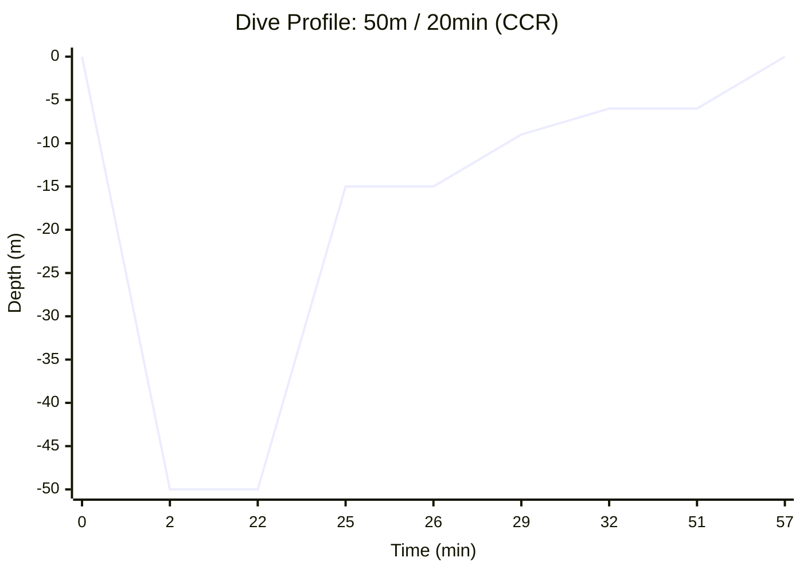

# Dive Plan Report: 50m for 20 minutes

**Location:** Technical Dive Site  
**Date:** 2026-03-14  
**Gas:** Tx 15/55 (15% O2, 55% He)  
**Model:** Bühlmann ZHL-16B with Gradient Factors (50/80)

---

## 1. Dive Profile Visualization

---

## 2. CCR Plan (Setpoint 1.2)

**Diluent:** Tx 15/55  
**Descent Rate:** 20 m/min | **Ascent Rate:** 10 m/min (1m/min < 10m)

### Deco Schedule
| Depth | Run Time | Stop Time | Gas | CNS % | OTU |
| :--- | :--- | :--- | :--- | :--- | :--- |
| **50m (Off-gassing starts)** | **22.5 min** | **20 min** | **Tx 15/55** | - | - |
| 15m | 26 min | 1 min | CCR SP 1.2 | 12.8% | 35.5 |
| 12m | 29 min | 2 min | CCR SP 1.2 | 14.1% | 39.0 |
| 9m | 32 min | 3 min | CCR SP 1.2 | 15.9% | 44.0 |
| 6m | 51 min | 19 min | CCR SP 1.2 | 26.0% | 71.3 |
| 0m | 57 min | **Surface** | Air | 26.0% | 71.3 |

### Gas Requirements
- **CCR Oxygen:** ~58 L | **19 bar** (on 3L cylinder)
- **Normal Diluent Consumption:** ~40 L | **2 bar** (on 16.5L cylinder)
- **Diluent (Bailout):** 1,888 L (Tx 15/55) | **114 bar** (on 16.5L cylinder)

---

## 3. Open Circuit Plan (Bailout/Backup)

**Bottom Gas:** Tx 15/55  
**Deco Gases:** Tx 50/15, Oxygen

### Deco Schedule
| Depth | Run Time | Stop Time | Gas | CNS % | OTU |
| :--- | :--- | :--- | :--- | :--- | :--- |
| **50m (Off-gassing starts)** | **22 min** | **20 min** | **Tx 15/55** | - | - |
| 18m | 25 min | 1 min | Tx 50/15 | 6.7% | 19.7 |
| 15m | 27 min | 2 min | Tx 50/15 | 7.7% | 22.5 |
| 12m | 30 min | 2 min | Tx 50/15 | 8.5% | 24.9 |
| 9m | 33 min | 5 min | Tx 50/15 | 10.1% | 29.5 |
| 6m | 50 min | 17 min | Oxygen | 47.8% | 62.6 |
| 0m | 56 min | **Surface** | Air | 47.8% | 62.6 |

### Gas Requirements
- **Tx 15/55 (Bottom):** 1,888 L | **114 bar** (on 16.5L cylinder)
- **Tx 50/15 (Deco):** 326 L | **60 bar** (on 5.4L stage cylinder)
- **Oxygen (Deco):** 408 L | **136 bar** (on 3L cylinder)

---

## 4. Safety Notes
- **Ascent Rate:** Slowed to 1m/min for the final 10m to surface.
- **CNS Warning:** CNS is well within limits for both modes (<50%).
- **OTU Warning:** OTUs are low (<100), safe for multi-day diving.

## 5. End-of-Dive Tissue Saturation (CCR Heat Map)
Final inert gas tensions across the 16 Bühlmann compartments relative to their surface M-Values ($M_0$).

| Comp | Half-time (N2/He) | $P_{N2}$ (bar) | $P_{He}$ (bar) | Tension | $M_0$ Limit | Load % | Heat Map |
| :---: | :---: | :---: | :---: | :---: | :---: | :---: | :--- |
| 1 | 4.0/1.5 | 0.06 | 0.03 | 0.09 | 3.58 | 2.5% | `░░░░░░░░░░` |
| 2 | 8.0/3.0 | 0.16 | 0.07 | 0.23 | 2.74 | 8.5% | `░░░░░░░░░░` |
| 3 | 12.5/4.7 | 0.29 | 0.13 | 0.42 | 2.41 | 17.5% | `█░░░░░░░░░` |
| 4 | 18.5/7.0 | 0.43 | 0.23 | 0.66 | 2.19 | 30.2% | `███░░░░░░░` |
| 5 | 27.0/10.2 | 0.55 | 0.39 | 0.94 | 2.06 | 45.6% | `████░░░░░░` |
| 6 | 38.3/14.5 | 0.63 | 0.55 | 1.18 | 1.95 | 60.5% | `██████░░░░` |
| 7 | 54.3/20.5 | 0.68 | 0.67 | 1.35 | 1.81 | 74.3% | `███████░░░` |
| 8 | 77.0/29.1 | 0.71 | 0.70 | 1.41 | 1.71 | 82.8% | `████████░░` |
| 9 | 109.0/41.2 | 0.73 | 0.66 | 1.39 | 1.63 | 85.4% | `████████░░` ⚠️ |
| 10 | 146.0/55.2 | 0.74 | 0.59 | 1.33 | 1.57 | 84.5% | `████████░░` |
| 11 | 187.0/70.7 | 0.74 | 0.52 | 1.26 | 1.53 | 82.5% | `████████░░` |
| 12 | 239.0/90.3 | 0.74 | 0.44 | 1.19 | 1.49 | 79.7% | `███████░░░` |
| 13 | 305.0/115.3 | 0.75 | 0.37 | 1.12 | 1.46 | 76.8% | `███████░░░` |
| 14 | 390.0/147.4 | 0.75 | 0.31 | 1.06 | 1.43 | 74.2% | `███████░░░` |
| 15 | 498.0/188.2 | 0.75 | 0.25 | 1.00 | 1.39 | 72.0% | `███████░░░` |
| 16 | 635.0/240.0 | 0.75 | 0.21 | 0.96 | 1.36 | 70.1% | `███████░░░` |
